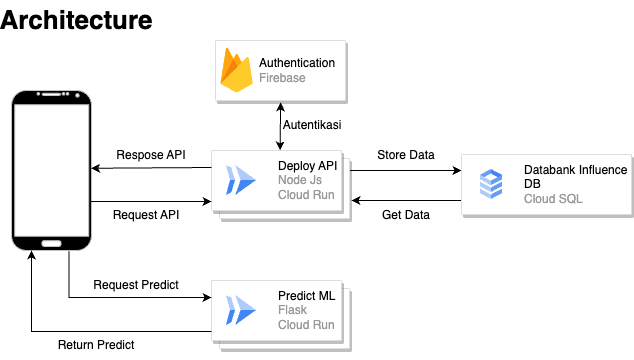

# InfluenceHub
# Tim CH2-PS592

## Anggota Tim

1. **Raihan Harits Fadhillah**
   - ID: M560BSY0137
   - Role: Machine Learning
   - Universitas: Universitas Ibn Khaldun Bogor

2. **Ibnu Afif Kusumahadi**
   - ID: M277BSY0259
   - Role: Machine Learning
   - Universitas: Universitas Indonesia

3. **Aryo Haris Wirakusuma**
   - ID: M010BSY0994
   - Program Studi: Machine Learning
   - Universitas: Universitas Bengkulu

4. **Agam Sufiandi**
   - ID:  C211BSY4369
   - Program Studi: Cloud Computing
   - Universitas: Universitas Indraprasta PGRI

5. **Firman Afatur Ikhsan**
   - NIM: CC560BSY3098
   - Program Studi: Cloud Computing
   - Universitas: Universitas Ibn Khaldun Bogor

6. **Ni Kadek Srimanik**
   - ID: A186BSX2028
   - Program Studi: Mobile Development
   - Universitas: Universitas Bakrie

## iFiCam Apps

### Deskripsi

InfluenceHub adalah 

### Link Unduh

Berikut adalah link untuk mengunduh aplikasi iFiCam: [InfluenceHub App](link_unduh_aplikasi)

## Build With

### Machine Learning:

- **Python**
- **TensorFlow**
- **Google Colab**
- **Roboflow**

### Mobile Development:

- **Figma**
- **Android Studio**
- **Kotlin**

### Cloud Computing:

- **Google Cloud Run**
- **Firebase**
- **Docker**
- **Express.js**
- **Flask**

## Architekture

## Getting Started

### Prerequisites:

- **Android**
- **Internet Connection**

### Mobile Development:

- **Download the .apk file**
- **Install the app and happy using**

# Kontak

| Nama                      | LinkedIn                                       |
|---------------------------|------------------------------------------------|
| Raihan Harits Fadhillah   | [LinkedIn](https://www.linkedin.com/in/raihan-harits/)             |
| Ibnu Afif Kusumahadi        | [LinkedIn](https://www.linkedin.com/in/ibnu-afif-kusumahadi/)            |
| Aryo Haris Wirakusuma        | [LinkedIn](https://www.linkedin.com/in/aryo-haris-wirakusuma-abbb27200/)               |
| Agam Sufiandi     | [LinkedIn](https://www.linkedin.com/in/muhammad-zaki-hamdani/)                  |
| Firman Afatur Ikhsan        | [LinkedIn](https://www.linkedin.com/in/firman-afatur-ikhsan/)                 |
| Ni Kadek Srimanik             | [LinkedIn](https://www.linkedin.com/in/srimanik/)               |
